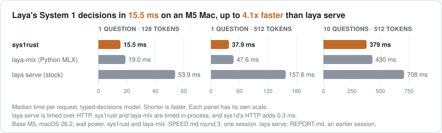
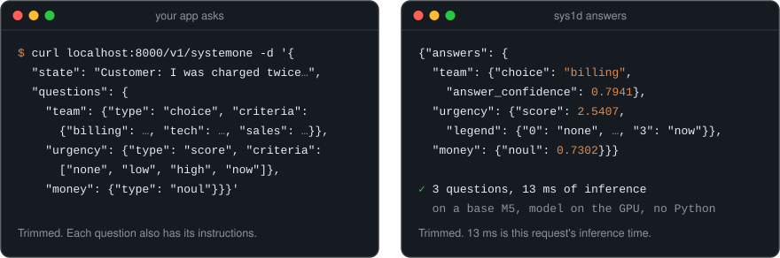
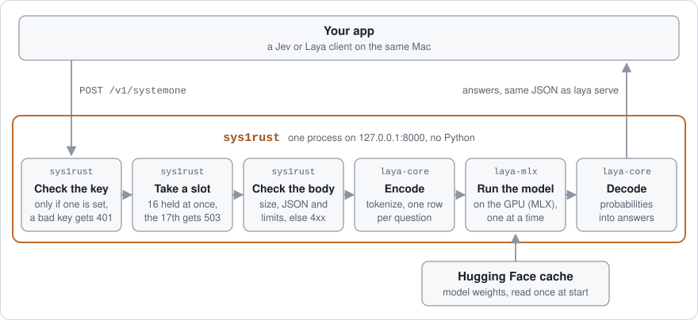

<p align="center">
  
</p>

<p align="center">
  <strong>sys1rust runs Laya's System 1 models on your Mac's GPU, in Rust with its own Metal kernels and no Python.</strong> Send it some text and a few questions, and it answers each one with a choice, a score or a yes probability. Its server, <code>sys1rust serve</code>, speaks the <code>/v1/systemone</code> API of <code>laya serve</code>, so Jev and Laya clients send it the same requests.
</p>

<p align="center">
  <a href="#speed"><strong>Speed</strong></a> ·
  <a href="results/README.md"><strong>Results</strong></a> ·
  <a href="#build"><strong>Build</strong></a>
</p>

<p align="center">
  
  
  
  
</p>

## Build

There is no release yet, so build it from source. You need an Apple silicon Mac, Rust 1.89 or newer, CMake, the Xcode command line tools, and Python 3.10 or newer. Python only fetches MLX. `sys1rust` doesn't run it.

```sh
# A prebuilt MLX 0.32.2 (the Python wheel ships libmlx and its CMake files).
python3 -m venv .mlx && .mlx/bin/pip install mlx==0.32.2
export MLX_SYS_PREBUILT_DIR="$(.mlx/bin/python -c 'import mlx.core, os; print(os.path.dirname(mlx.core.__file__))')"

# The binaries go to runtime/target/release/.
cargo build --release --manifest-path runtime/Cargo.toml
```

The binary loads MLX from that venv by its absolute path, so keep `.mlx/` where it is. A self-contained release is the next step.

## Try it

Start the server. The first start downloads the typed-decisions model (846 MB) into the Hugging Face cache:

```sh
runtime/target/release/sys1rust serve --port 8000
```

It prints `listening on http://127.0.0.1:8000` when it's ready. In another terminal:

```sh
curl -s localhost:8000/v1/systemone -H 'content-type: application/json' -d '{
  "state": "Customer: I was charged twice for my subscription this month and I need it fixed today.",
  "questions": {
    "team": {"type": "choice", "instructions": "Which team should handle this?",
             "criteria": {"billing": "payments, charges and refunds", "tech": "bugs and outages", "sales": "new purchases"}},
    "urgency": {"type": "score", "instructions": "How urgent is this?",
                "criteria": ["none", "low", "high", "now"]},
    "money": {"type": "noul", "instructions": "Is money involved?"}
  }
}'
```

<p align="center">
  
</p>

On the base M5, inference for this request took 13.0 to 13.3 ms over 18 runs, 6 in each of 3 fresh processes after 2 warm-up requests. That is the `X-Inference-Time-Ms` header, which `curl -si` shows. It covers tokenizing, running the model and decoding. It leaves out reading and checking the request, waiting for the GPU and writing the reply.

Each question gets one of three answer types:

| type | you give | you get back |
| --- | --- | --- |
| `choice` | labels, each with a description | `choice`, the most likely label, and `probabilities` for every label |
| `score` | an ordered list of levels | `score`, the expected level (it can fall between levels), `probabilities` per level, and a `legend` |
| `noul` | only the instructions | `noul`, the probability that the answer is yes |

Every answer also has two confidence numbers, which measure different things:

- `answer_confidence` is the probability of the answer given. It is the one to use for deciding whether to trust an answer.
- For `choice` and `score`, `confidence` is 1 minus the normalized entropy of the probabilities. It is 0 for an even split and 1 when everything is on one option. For `noul`, it equals `answer_confidence`: the larger of the yes and no probabilities, which is 0.5 for an even split.

Don't compare the two against the same threshold. `action.act_probability` comes from a second output of the model: its probability for acting on the answer rather than escalating. Ctrl-C stops the server, and when it stops, the model is out of memory.

## How it works

<p align="center">
  
</p>

- **It checks requests the way `laya serve` does**, with the same limits, error codes and `detail` strings. It checks the API key first, then takes a slot, then reads and checks the body.
- **The GPU runs one request at a time.** `sys1rust` holds up to 16 requests (`LAYA_MAX_CONCURRENT`), one running and the rest waiting their turn. A request that arrives while all 16 slots are held gets `503` with `Retry-After: 1` at once, so clients must retry it. More clients don't get more throughput, since one request already fills the GPU.
- **All the questions in a request go through the model together**, one row per question, in fp16.
- **It beats Python MLX by doing less work and tuning its matmuls, not by being Rust.** It skips computing on padding, runs the decision head's last layer only at the positions the answer reads, uses dense attention where that is cheaper, and from 512 tokens computes local attention only over the keys each window reaches. Its matmuls run MLX's own kernels for the M5's matrix units, with tile sizes tuned on this M5. The answers don't change.
- **It downloads a model once, at a pinned revision.** The first `sys1rust serve` fetches the five files the model needs (846 MB for typed-decisions) into the Hugging Face cache and checks each one's hash. Later starts read them from there. `--offline` turns downloads off.

## Speed

Median time per request for the typed-decisions model on a base M5, in ms. These are the numbers in the chart at the top.

| median ms | 1 question, 128 tokens | 1 question, 512 tokens | 10 questions, 512 tokens |
| --- | --- | --- | --- |
| sys1rust | 15.5 | 37.9 | 379 |
| laya-mlx, Python MLX at its fastest (compiled, buffer cache capped) | 19.0 | 47.6 | 430 |
| `laya serve`, stock, over HTTP | 53.9 | 157.6 | 708 |

- **Against stock `laya serve`**, it is 1.9 to 4.1x faster per request, counting `sys1rust`'s 0.3 ms of HTTP. The `laya serve` times come from the bake-off ([`REPORT.md`](results/REPORT.md)), an earlier session than the round 3 sys1rust times, and separate runs on this laptop vary by about 5%. In earlier runs, `sys1rust` sustained 7.9 requests/s over 5 minutes, and `laya serve` 3.54 over 2 minutes. `laya serve` runs fp32 for requests with fewer than 5 questions, but even upstream in fp16, which it doesn't ship, is 1.9 to 2.9x slower on these three sizes, also against times from an earlier session.
- **Against Python laya-mlx at its fastest**, it is 1.25x faster, and faster on all 12 benchmark sizes, by 13 to 55%.
- **It gives the same answers.** On the 1,500-answer correctness workload, 1,498 agree with the upstream PyTorch fp32 reference (99.9%, above the 99% gate). The two that differ are near ties.
- **Its tail stays close to the median.** In the timing runs, no request took more than twice the median for its size. Python MLX without a capped cache had 9% of requests over that line.
- **It starts fast and is small.** From process start to the first answer takes 243 to 375 ms, with the model files already in the OS file cache. `sys1rust` is a 7 MB binary, and its HTTP layer adds 0.3 ms per request. macOS caches the compiled GPU kernels by the binary's path and the kernel source, so the first start from a new path or after a kernel change takes about 1.7 s longer.

Everything here was measured on one Mac: a MacBook Pro 14 with a base M5, on macOS 26.2 and wall power. Other chips are untested. The write-ups are in [`results/`](results/README.md). They run from the bake-off of 13 existing runtimes ([`REPORT.md`](results/REPORT.md)) to the speed round ([`SPEED.md`](results/SPEED.md)).

## Models

| `--model` | Hugging Face repo | encoder | agreement with upstream fp32 answers |
| --- | --- | --- | --- |
| `typed-decisions` (default) | `convaiinnovations/laya-typed-decisions` | ModernBERT-large | 1,498 of 1,500 on correctness |
| `multilingual` | `convaiinnovations/laya-multilingual` | mmBERT-base | 100% on correctness, smoke and short |
| `english` | `convaiinnovations/laya` | ModernBERT-large | 100% on smoke, short and cold; no upstream correctness reference exists |

The first `serve` of a model downloads it. `--model` also takes a local checkpoint directory, which `sys1rust` reads without downloading anything; the Hugging Face CLI's `hf download <repo>` fetches another hub checkpoint and prints its directory.

## More

<details>
<summary><strong>Options</strong></summary>

Each flag falls back to an environment variable. The `LAYA_*` ones are the same as `laya serve`'s.

| flag | environment variable | default | |
| --- | --- | --- | --- |
| `--model` | `SYS1_MODEL` | `typed-decisions` | a name from [Models](#models), its repo id, or a checkpoint directory |
| `--revision` | `SYS1_REVISION` | the pinned one | serve `snapshots/<sha>` of the cached repo instead. The pin's first 7 characters, as `sys1rust models` shows them, also mean the pin |
| `--host` | `LAYA_HOST` | `127.0.0.1` | bind address; `laya serve` binds `0.0.0.0` |
| `--port` | `LAYA_PORT` | `8000` | `0` picks a free port, printed on the ready line |
| `--api-key` | `LAYA_API_KEY` | none | when set, `/v1/systemone` needs `Authorization: Bearer <key>` |
| `--max-concurrent` | `LAYA_MAX_CONCURRENT` | `16` | requests held at once; the next one gets `503` |
| `--tuning` | `SYS1_MLX_TUNING` | the measured default | engine settings, see `Knobs` in `runtime/crates/laya-mlx` |
| `--f32` | `SYS1_F32` | off | run the transformer in f32 instead of the checkpoint's f16 |
| `--offline` | `HF_HUB_OFFLINE` | off | never download; a model that is not in the cache is an error. `HF_HUB_OFFLINE` turns it on when set to `1`, `ON`, `YES` or `TRUE`, in any letter case |

`sys1rust pull [model]` downloads a model ahead of time and `sys1rust models` lists what is downloaded. Downloads honor `HF_ENDPOINT` and `HF_TOKEN`. `sys1rust` sends the token only to the endpoint, never after a redirect.

`sys1rust` sets MLX's `MLX_MAX_MB_PER_BUFFER` to 10, measured faster on the M5, unless it is already set. At load it checks its M5 matmul kernels against MLX's, bit for bit, and prints the result on stderr. If the check fails, it uses MLX's matmuls and prints why.

When it's ready, `sys1rust` prints one JSON line on stdout with the address, model, revision, load time and warm-up time. `GET /health` reports the model, revision and engine. SIGINT or SIGTERM lets requests in flight finish before it exits. `runtime/target/release/sys1rust serve --help` lists everything.

</details>

<details>
<summary><strong>Serving other machines</strong></summary>

`sys1rust` listens on 127.0.0.1 by default, so only programs on the same Mac can reach it. Keep that default. `sys1rust` speaks plain HTTP without TLS, and it has no header read timeout and no connection limit. Only the request body has a deadline, and a body that takes over 10 s gets `408`.

An API key alone does not make remote serving safe. With `LAYA_API_KEY` set, `/v1/systemone` answers only requests that send `Authorization: Bearer <key>`, but over plain HTTP anyone on the network path can read that key. The key is checked only once the headers have arrived, so it does nothing against connections that never finish sending them. Each such connection holds a socket for as long as the client keeps it open, and nothing caps how many there are.

To serve clients on other machines, run a reverse proxy on the same Mac in front of `sys1rust`. The proxy should terminate TLS, time out slow headers, limit connections and forward to 127.0.0.1. Set an API key as well:

```sh
export LAYA_API_KEY=replace-with-a-secret
runtime/target/release/sys1rust serve --port 8000   # the proxy forwards to 127.0.0.1:8000
```

`--host` changes the bind address, but any client that can reach a wider address talks to `sys1rust` directly, with none of the proxy's protections.

</details>

<details>
<summary><strong>Differences from <code>laya serve</code></strong></summary>

- **Bind address.** `sys1rust` listens on 127.0.0.1 by default. `laya serve` listens on 0.0.0.0.
- **Downloads.** `sys1rust` downloads only the three Laya models, only at the revisions pinned in `bench/models.lock.json`, and only the five files each one needs. `laya serve` downloads any model repo at its newest revision.
- **Duplicate choice keys.** When two of a choice's labels print as the same JSON key, such as `"1"` and `1`, upstream writes that key twice in `probabilities`, and `sys1rust` writes it once with the second label's probability. Python's `json`, JavaScript's `JSON.parse` and serde_json's `Value` keep the last duplicate, so a client parsing with one of them gets the same object from both servers. A parser that rejects duplicate keys or keeps the first one reads the two responses differently.
- **JSON.** `sys1rust` accepts standard JSON in UTF-8. Upstream's `json.loads` also accepts `NaN`, `Infinity` and `-Infinity`, `\u` escapes of unpaired surrogates, and bodies in UTF-16 or UTF-32 or with a byte order mark. `sys1rust` answers those with 400 `request body must be valid JSON`.

</details>

<details>
<summary><strong>Build and run inside the benchmark setup</strong></summary>

Use this instead of [Build](#build) when working on the benchmark. `bench/env.sh` takes MLX from the laya-mlx contender's venv but does not create it, so the first step sets that venv up once, as in `bench/contenders/laya-mlx/NOTES.md`. That step needs `uv`. The script also keeps the Cargo output and the Hugging Face cache under `bench/`, so the binary is at `$CARGO_TARGET_DIR/release/sys1rust`. The commands download and serve the typed-decisions revision pinned in `bench/models.lock.json`, the one the results used.

```sh
source bench/env.sh
# Once: the laya-mlx contender's venv, with MLX 0.32.2 and the hf CLI.
git clone https://github.com/mizorewww/laya-mlx bench/contenders/laya-mlx/src
(cd bench/contenders/laya-mlx/src && git checkout -q 0a859518634112655cb97c745dbf04f5191aaf13 &&
  UV_PROJECT_ENVIRONMENT=../.venv uv sync --frozen --python 3.12 --managed-python)

cargo build --release --manifest-path runtime/Cargo.toml
REV=1a793eb568e6718f15941d08f85432581df534e3   # typed-decisions sha in bench/models.lock.json
bench/contenders/laya-mlx/.venv/bin/hf download convaiinnovations/laya-typed-decisions --revision $REV
$CARGO_TARGET_DIR/release/sys1rust serve --model typed-decisions --port 8000
```

</details>

<details>
<summary><strong>Repository layout</strong></summary>

- `runtime/`: the Rust workspace.
  - `laya-core`: request parsing, tokenization, sequence layout and answer decoding, with no GPU code.
  - `laya-mlx`: the forward pass on MLX through mlx-rs.
  - `sys1rust`: the command and its HTTP server.
  - `sys1-bench`: the benchmark adapter and `sys1-probe`.
  - `vendor/mlx-sys`: mlx-sys 0.6.0 with a build that can link a prebuilt MLX.
- `bench/`: the benchmark harness, workloads and upstream reference answers (`bench/PLAN.md`).
- `results/`: measured write-ups, from the bake-off of existing runtimes to the speed round.
- `research/`: sourced reports on the models, runtimes and hardware.
- `docs/assets/`: the diagrams in this README.

</details>

## License

Apache-2.0. `laya-core` and `laya-mlx` started as a fork of tjameswilliams/laya-r-mlx, and `vendor/mlx-sys` is from oxiglade/mlx-rs. See [`NOTICE`](NOTICE).
